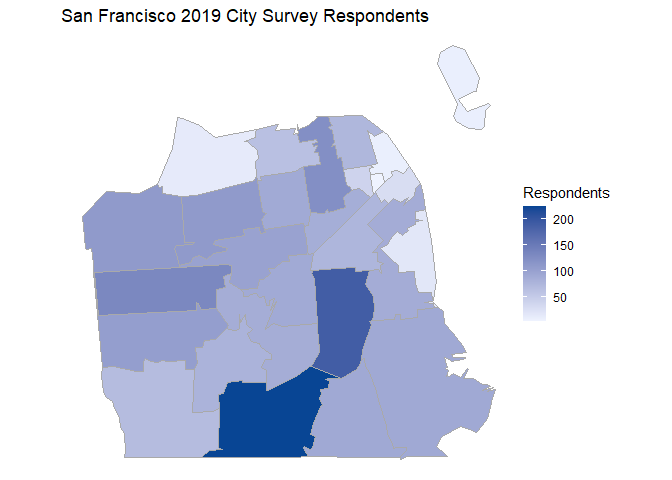
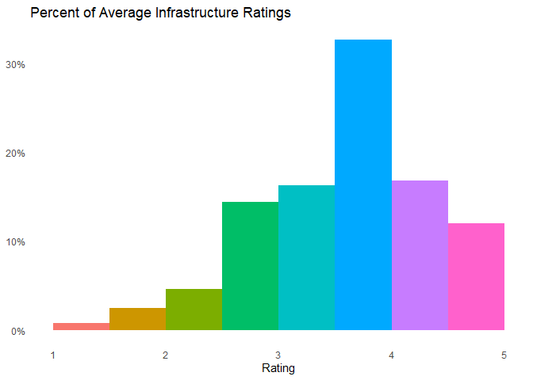
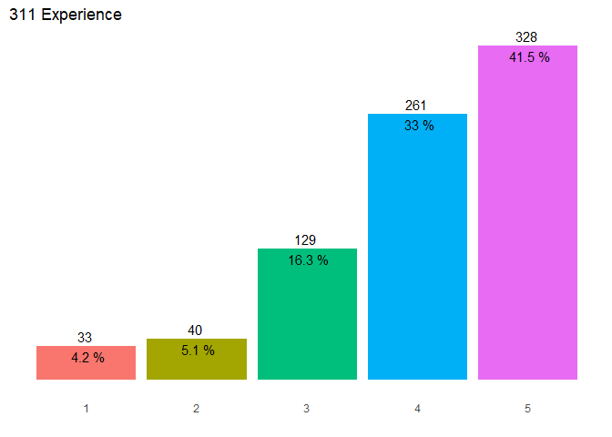

2019 San Francisco Survey Analysis
================

### Introduction

The San Francisco City Survey is conducted every two years to assess city residents' satisfaction with their city's services. In 2019 the City Survey received a random sample of 2,218 respondents living in San Francisco who graded the performance of the City's infrastructure, parks, libraries, Muni, public safety, and 311 services on a 1 to 5 point scale, where 1=Failing, 2=Poor, 3=Average, 4=Good, and 5=Excellent. The aim of this project is to explore survey results to understand people's satisfaction level and impression with city services and issues, and analyze how demographics affect survey results. I will mainly use R's ggplot2 to create various data visualizations and present my findings.

### Executive Summary:

**Demographics**

-   The Excelsior, Mission, and Oceanview neighborhoods had the most respondents.
-   There are 8.6% more males than females and slightly more males than females in all age groups.
-   The age distribution is bimodal with a peak at age group 35-44, which make up about 23% of respondents, and a peak at age group 65 and over, which make up about 17% of respondents.
-   About 12% are LGBTQ+.
-   The distribution of the major racial/ethnic groups are: White (51%), Asian (22%), Hispanic (12%), and African American (5%).
-   About 55% have a household income of at least $100k.
-   About 70% have at least a 4 year college degree.
-   Most households are 2 people (33%).
-   72% don't live with any children.
-   57% rent a home and 42% own a home.
-   About 67% have lived in SF for over 10 years.

**City Services Ratings**

-   The top 3 highest overall ratings of the City's services are: Libraries (4.40/5, A-), Schools (4.26/5, B+), and Recreation/Parks (4.06/5, B+).

**Infrastructure**

-   Overall rating: 3.65/5 (B-)
-   Quality of water services and reliability of sewer services had over 75% of good/excellent ratings.
-   Polk Gulch/Nob Hill and Inner Mission neighborhoods have the dirtiest streets and sidewalks.

**Recreation and Parks**

-   Overall rating: 4.06/5 (B+)
-   Over 75% were satisfied/very satisfied with the overall quality of city parks.
-   75% visit the city parks at least once a week or at least once a month in 2019.
-   31% have participated in a recreation and Parks Department program or used a recreation center.
-   Subratings are mostly positive with high percentages of good/excellent ratings.

**Libraries**

-   Overall rating: 4.40/5 (A-)
-   52% rated excellent on the overall quality of city libraries.
-   A majority have never used the City's main, branch, or online library in 2019.
-   More frequent users of city libraries use the online and branch libraries more than the main library.
-   All subratings had over 75% of good/excellent ratings.

**Transportation**

-   Overall rating: 3.19/5 (C+)
-   Walking was the most used, while biking was the least used.
-   86% have used Muni in 2019.
-   Courtesy of Muni drivers rated highest, while managing crowding rated lowest.

**Public Safety**

-   Overall rating: 3.85/5 (B)
-   Respondents from West of Twin Peaks and Sunset feel the most safe while walking alone in their neighborhood at night, while respondents from areas in the southeast feel the least safe.

**311 Experience**

-   Overall rating: 4.03/5 (B+)
-   51% of those who have heard of 311 have used 311 in 2019.

**Schools**

-   Overall rating: 4.26/5 (B+)
-   The average rating of SF private schools is higher than SF public schools by 0.44.

**Rating Differences**

-   African Amercians reported the lowest percentage of good/excellent ratings on the overall local government performance, infrastructure, parks, . When restricted to those living with children, they reported 96% of good/excellent ratings on city libraries.
-   Whites reported the highest proportion of good/excellent ratings on city parks, 311 experience.
-   Hispanics reported the highest percentage of good/excellent ratings on city government performance, infrastructure, libraries, Muni, but reported the lowest percentage of good/excellent ratings on SF schools.
-   Females from all racial/ethnic groups feel less safe walking alone at night than males. Mixed ethnicity women and Hispanic women feel the least safe walking alone at night.
-   Frequent users of city parks, the branch and online library, and Muni tend to give more good/excellent ratings than infrequent users.

**2019 City Issues and Impression**

-   Top issues: general homelessness, combatting homelessness, increasing housing cost, lack of affordable housing, open drug dealing/using.
-   Most feel that homelessness, street and sidewalk cleanliness, and public safety has gotten worse in the last 2 years.
-   75% feel that homelessness has gotten worse since 2017.

**Moving Out of SF**

-   35% were likely to move out of SF in the next 3 years.
-   Those who were the most likely to move out were Black/African Americans who lived 10 years or less in SF and have a household income of $50k or greater.
-   Those from the Presidio neighborhood were the most likely to move out.

### Demographics

-   We see that a large number of respondants is from the Exelsior, Mission, and Oceanview neighborhoods.

#### Gender

-   There are 8.6% more male respondents than female respondents.
-   1.2% identifies as neither female nor male.

#### Age

-   Mpst (23.6%) responents were ages 35-44.
-   17% of respondents were ages 65 and over, about 4 times more than those of ages 18-24.

#### Age by Gender

-   There are more males than females in all age groups.

#### Sexual orientation

-   11.9% of respondents identify as LGBTQ+.

#### Race/Ethnicity

-   The majority of survey respondents are white, making up a majority (51.4%) of respondents. 
-   The sample size of American Indian/Alaska Native is extremely small.

#### Household Income

-   A majority of respondents (54.9%) have a household income of at least $100k.
-   Less than 25% of respondents have a household income of less than $50k.

#### Highest Level of Education

-   About 70% of respondents have at least a 4 year college degree.
-   Less than 5% have less than a high school diploma.

#### Household Size

-   Most households are 2 people households (32.8%).
-   The second most common household size is 1 person (19.7%).

#### Children

-   72% of respondents don't live with any children in SF.

#### Home Ownership

-   A majority (57%) of respondents rent and 42% own a home.
-   About 1% of respondents do not own or rent a home.

#### Residence

-   Over 66% of respondents have lived in San Francisco for more than a decade.
-   Most (29.3%) respondents have lived in SF for at least 30 years.

### Average Ratings

-   The top 3 highest average ratings are: Libraries, Schools, and Recreation and Parks.
-   Libraries have the highest average rating of 4.40/5 (A-).
-   Muni have the lowest average rating of 3.19/5 (C+).

### Government Performance

#### Rating of Overall Job of Local Government

-   78% of respondents rated 3(Average) or 4(Good) on the overall performance of the local government.

#### Differences by Race/Ethnicity

-   African Americans and Other reported a lower porportion of high ratings for the overall government performance when compared to other groups.
-   A majority of Hispanics, Asians/Pacific Islanders, and people of mixed ethnicity believe that the overall government performance is good/excellent.

### Infrastructure

#### Average Infrastructure Subratings

-   Over 30% of respondents have an average infrastructure subrating between 3.5(B-) and 4(B).
-   Almost 30% of respondents have an average subrating over 4.

#### Differences by Race/Ethnicity

-   African Americans report the lowest percentage of good/excellent ratings.
-   Hispanics report the highest percentage of good/excellent ratings (45.2%), almost twice than that of African Americans (23.7%).

Next, we analyze the subratings for the City's infrastructure.

We find:
\* Both quality of water services and reliability of sewer services received over 75% of good/excellent ratings.
\* Cleanliness of streets and sidewalks received the largest amount of 1's.

#### Which areas have the dirtiest streets and sidewalks?

-   A large percentage of low ratings on cleanliness were in the Polk Gulch/Nob Hill and Inner Mission neighborhoods.

### Recreation and Parks

#### Rating of Overall Quality of Recreation and Park System

-   A majority (78.6%) of respondents are satisfied/very satisfied with the overall quality of the City's recreation and park system.

#### How often do residents visit parks?

-   75% of respondents visit the City park at least once a week or at least once a month in 2019.

#### Rating Differences by Park Usage

-   Frequent users of the City's parks tend to give more good/excellent ratings on the overall park system than nonfrequent users.
-   There is only a slight 1% difference between the proportion of good/excellent overall park system ratings of frequent users of the City's parks. This difference is also 1% between those who visit once or twice a year and several times a year.
-   63% of respondents who never visited the City's parks in 2019 gave a rating of good/excellent on the overall park system.

#### Differences by Status of Livings with Children and Race/Ethnicity

-   Those who are white and are living with children reported the highest percentage of good/excellent ratings for the quality of parks (87.5%).
-   Those who are African American and not living with children reported the lowest percentage of good/excellent ratings (63%).

-   The ratings for parks are mostly positive with high proportions of 4's and 5's in all areas.
-   Cleanliness of parks has the lowest proportion of high ratings.
-   It seems that a majority of residents are satisfied/very satisfied with the overall quality of the City's park system.

#### Recreation Program and Recreation Center

-   31% of respondents have participated in a Recreation and Parks Department program or used a Recreation and Parks Department recreation center.

-   Over 75% of ratings were good/excellent for both the condition of buildings and quality of recreation programs and activities.

### Libraries

#### Rating of Overall Quality of Library System

-   A majority of respondents rated 5(Excellent) on the overall quality of the City's library system.
-   Less than 10% of respondents gave ratings of 1(Failing), 2(Poor), 3(Average). 
-   Ratings for the City's overall library system is the highest by far.

#### How often do residents access libraries and their services?

-   During the past 12 months in 2019, a majority of respondents have never used the City's main, branch or online library.
-   The ratio of "Never" to "At least once a week is" about 9:1.
-   Those who visit the library at least once a month/week uses the City's branch and online library more than the main library.

#### Rating Differences by Library Usage

    ## `summarise()` regrouping output by 'grade' (override with `.groups` argument)
    ## `summarise()` regrouping output by 'grade' (override with `.groups` argument)
    ## `summarise()` regrouping output by 'grade' (override with `.groups` argument)

-   Frequent users of the branch library and online library services tend to give more good/excellent ratings on the overall library system than nonfrequent users.
-   There is little to no difference between the proportion of good/excellent overall library system ratings of frequent users and that nonfrequent users of the City's main library.

#### Differences by Status of Livings with Children and Race/Ethnicity

-   Hispanics who were living with children reported the highest percentage of good/excellent ratings on the quality of the City's libraries (96.5%).
-   African Americans who were not living with children reported the lowest percentage of good/excellent ratings (83.8%).
-   Except for people of mixed ethnicity, the percentage of good/excellent ratings for those who were living with children was higher than that of those who were not living with children.

#### Library Condition and Services

-   Over 75% of ratings are good/excellent in all areas.
-   It seems that a majority of residents are satisfied/very satisfied with the overall quality of the City's library system.

### Transportation

#### Rating of Overall Quality of Muni

    ## # A tibble: 1 x 1
    ##   `mean(muni_rate)`
    ##               <dbl>
    ## 1              3.19

-   Most (37.4%) respondents rated 3(Average) on the overall quality of Muni.
-   32.6% of respondents rated 4(Good).
-   

#### Frequency of Transportation

The following is a mosaic plot of the frequency of respondents, categorized by modes of transportation and their frequency. 

-   About 30% of respondents have never biked, rode a taxi, or carpooled as a means of transportation in SF in 2019.
-   More respondents have used Uber than Taxi or Carpool.
-   Most respondents who have used Uber used it less than 1 or 1-2 days/week.
-   Walking, driving, and riding Muni were the most frequently used mode of transportation.

-   Walking was the most commonly used mode of transportation, and biking was the least used.
-   85.7% of respondents have used Muni as a means of transportation in 2019.
-   76% of respondents have driven and 75% have used Uber.

#### Rating Differences by Muni Frequency

-   Frequent users of Muni and online tend to give more good/excellent ratings on the overall quality of the Muni system than nonfrequent users.
-   Those who used the Muni 3-6 days/week contributed to the highest proportion of good/excellent Muni ratings.

#### Differences by Muni User Status and Race/Ethnicity

-   Among users and nonusers of Muni, Hispanics reported the highest percentage of good/excellent ratings.
-   Among users of Muni, whites reported the lowest percentage of good/excellent ratings (39.2%).
-   Among nonusers of Muni, Other reported the lowest percentage of good/excellent ratings (14.3%).
-   Except for Asians and Hispanics, users of Muni reported a higher percentage of good/excellent ratings than nonusers of Muni.

#### Muni Subratings

-   Courtesy of Muni drivers received the highest proportion of good/excellent ratings and lowest proportion of fail/poor ratings.
-   Managing crowd received the lowest proportion of good/exceelent ratings and highest proportion of failing/poor ratings.

### Public Safety

-   Ratings for public safety were mostly between 3.5 and 5.
-   Respondents generally feel safe to very safe walking alone in their neighborhood.

#### Public Safety Subratings

-   About 85% of respondents felt safe/very safe while walking alone in their neighborhood during the day.
-   Just a slight majority of respondents felt safe/very safe while walking alone in their neighborhood at night.

#### Differences by Gender and Race/Ethnicity

#### Day

-   Hispanic women report the lowest proportion of safety walking alone in their neighborhood during the day.
-   Almost 90% of Whites and Other females reported high ratings of safety during the day.
-   A lower proportion of Asian, Black, and Hispanic women report feeling safe/very safe during the day compared to males of these groups.
-   There appears to be very little difference in the proportion of high ratings of safety during the day between White males and White females.

#### Night

-   People of mixed ethnicity reported the lowest proportion of high ratings of safety walking alone in their neighborhood at night.
-   2 out of 4 American Indians reported high ratings of safety at night.
-   Females have a lower proportion of high ratings of safety at night than males, except for American Indians.

#### Which areas have higher public safety ratings?

    ## Warning in self$bind(): The following regions were missing and are being set to
    ## NA: 94129, 94130, 94111, 94158, 94105, 94104

    ## Scale for 'fill' is already present. Adding another scale for 'fill', which
    ## will replace the existing scale.

-   Respondents felt most safe walking alone in Twin Peaks West and Sunset neighborhoods at night.
-   Respondents from areas in the northeast, central east, and southeast tend to feel less safe walking alone at night than other areas.

### 311 Experience

-   A slight majority (51%) of respondants who have heard of 311 have used 311 in 2019.

#### Rating of 311 Experience

-   A high percentage (74.5%) of respondents had a good/excellent experience using 311 in 2019.

#### Differences by Race/Ethnicity

    ## `summarise()` ungrouping output (override with `.groups` argument)

-   Except for Other, all other groups reported over 70% of good/excellent ratings on their experience using 311.

### Schools

#### Rating of Quality of Schools

-   A large majority of ratings for the quality of SF schools were good/excellent.
-   Only about 3% of respondents rated failing/poor.

#### Public vs. Private Schools

-   SF private schools had a higher average rating than SF public schools by 0.44 points.

#### Differences by Race/Ethnicity

    ## `summarise()` ungrouping output (override with `.groups` argument)

-   Over 90% of ratings were good/excellent for both White and Other.
-   Hispanics reported the lowest percentage of good/excellent ratings (77.7%).

### Summary of Grades

### 2019 Issues

Next, I analyzed the many issues facing the City.

-   The top 5 important issues in 2019 were: general homelessness, effective solutions to combat homelessness, increasing housing cost, lack of affordable housing, and open drug dealing/using.

### Impressions

-   Most respondents feel that homelessness, street and sidewalk cleanliness, and public safety has gotten worse in the last 2 years.
-   Homelessness remains a major problem.

### Likelihood of Moving Out of SF In the Next 3 Years

-   Most (42.4%) respondents were not likely at all to move out of SF in the next 3 years.
-   35.5% of respondents were somewhat or very likely to move out.

#### Who is likely to move out of SF?

#### Differences by Race/Ethnicity, Years Lived in SF, and Income

-   Those who lived in SF for 10 years or less tend to be more likely to move out of SF in the next 3 years than those who lived in SF for more than 10 years.
-   African Americans who have a household income of $50k or greater and have lived in SF for 10 years or less were the most likely to move out of SF.
-   Asians who have a household income of less than $50k and have lived in SF for more than 10 years were the least likely to move out of SF.

#### Differences by Geographic Area

-   Respondents from the Presidio neighborhood were the most likely to move out of SF in the next 3 years.
-   Those from the north, northeast and central east were more likely to move out of SF than those from other areas.
